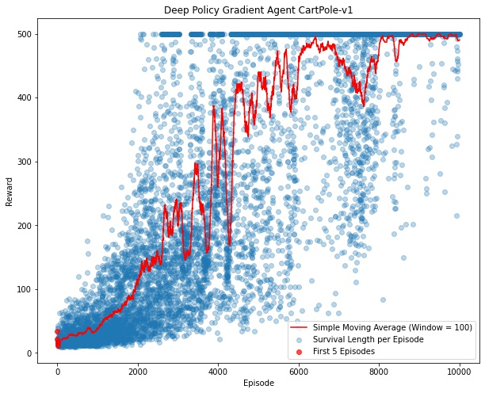
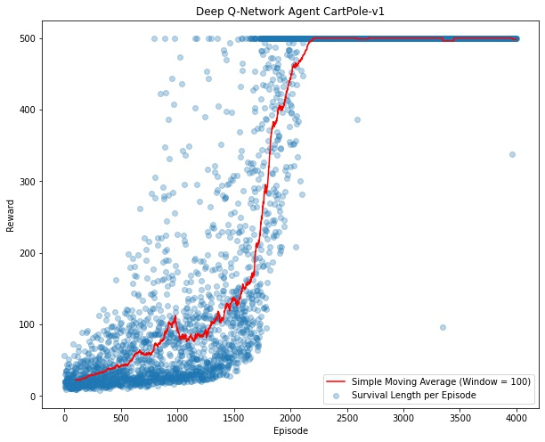

# CartPole_RLfromScratch
## Policy Gradient and DQN methods on Cartpole-v1 gym environment 

This repo contains Policy Gradient and DQN Reinforcement Learning method implementations from scratch (without using any RL/ML/NN libraries) with Numpy. 

## CartPole-v1 Environment 
In CartPole-v1, a pole is attached by an un-actuated joint to a cart, which moves along a friction-less track. The system is controlled by applying a force of +1 or -1 to the cart. The pendulum starts upright, and the goal is to prevent it from falling over. A reward of +1 is provided for every timestep that the pole remains upright. The episode ends when the pole is more than 15 degrees from vertical, or the cart moves more than 2.4 units from the center.
* Push Left: Given the action "0" the cart is pushed to the left. 
* Push Right: Given the action "1" the cart is pushed to the right.

    
### Policy Gradient
After 10000 training episodes the agent is able to reach and maintain the maximum possible rewards. 
The trained agent's SMA Cumulative Rewards vs Episodes Plot 

### Deep Q-Network
After 4000 training episodes the agent is able to reach and maintain the maximum possible rewards. 
The trained agent's SMA Cumulative Rewards vs Episodes Plot 

The project is implemented in part of Bilkent University EEE485/585 Statistical Learning and Data Analytics term project.
- - - -
